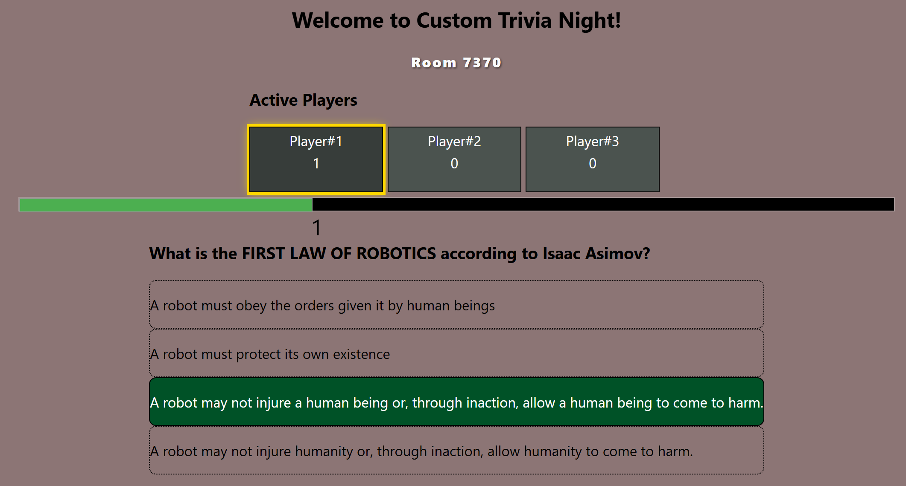

# Multiplayer Live Quiz Demo: A Kotlin + Spring Boot WebSockets Project

This is a real-time multiplayer quiz app built with Kotlin, Spring Boot, and WebSockets. You can compete in a live real-time quiz with other players in a shared lobby.

## Demo Video

(if video autoplay does not work, see below .gif)

## Purpose
- explore a bit of Kotlin (coming from Java)
- learn the basics of Spring Boot (inversion of control, dependency injection, beans, annotations)
- play around with WebSockets' real-time persistent connection
- learn how coroutines work

## Core Features
- join lobby with a nickname, and late-joiners to game are auto-kicked
- core game loop (including Quiz Timers) handled by coroutines
- real time updates (through WebSockets): player scores, players joining and leaving the lobby, Quiz Timers
- disconnected players don't disrupt the current game

## Technologies Used
- **Backend**: Kotlin + Spring Boot, WebSockets, Kotlin Coroutines
- **Frontend**: React.js

### Gameplay GIF

## Limitations and Further Areas of Improvement
- coupling

## How to run 

## Addendum

### Things Learnt
- https vs websockets
- long polling vs persistent connections
- companion objects
- coroutines and job
- Spring Boot DI, IoC, beans, component

### WebSockets

### Kotlin

### Spring Boot

